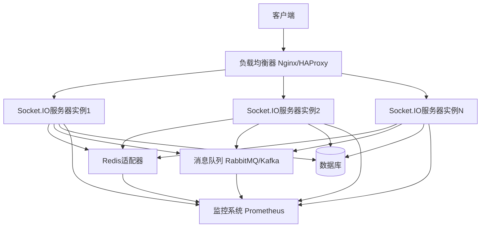

# Socket.IO 高并发架构设计文档

## 概述

本文档详细描述了Socket.IO在1000+并发用户场景下的扩展性和性能优化策略，包括完整的架构设计和实现方案。

## 系统架构概览



## 1. WebSocket连接管理和资源优化

### 1.1 连接池管理

- **连接限制**: 每个服务器实例最大连接数: 5000
- **连接超时**: 心跳检测间隔25秒，超时60秒
- **内存优化**: 使用对象池减少GC压力

### 1.2 资源配置

```javascript
// 服务器配置优化
const serverConfig = {
  maxHttpBufferSize: 1e6, // 1MB
  pingTimeout: 60000,
  pingInterval: 25000,
  transports: ['websocket', 'polling'],
  allowEIO3: false, // 强制使用Engine.IO 4+
  cors: {
    origin: process.env.ALLOWED_ORIGINS?.split(',') || ['http://localhost:3000'],
    methods: ['GET', 'POST'],
    credentials: true
  }
};
```

## 2. 负载均衡和集群部署方案

### 2.1 Sticky Sessions配置

```nginx
# Nginx配置
upstream socketio_backend {
    ip_hash; # 启用sticky sessions
    server 127.0.0.1:3001;
    server 127.0.0.1:3002;
    server 127.0.0.1:3003;
}

server {
    listen 80;
    location /socket.io/ {
        proxy_pass http://socketio_backend;
        proxy_http_version 1.1;
        proxy_set_header Upgrade $http_upgrade;
        proxy_set_header Connection "upgrade";
        proxy_set_header Host $host;
        proxy_set_header X-Real-IP $remote_addr;
        proxy_set_header X-Forwarded-For $proxy_add_x_forwarded_for;
        proxy_cache_bypass $http_upgrade;
        proxy_read_timeout 86400;
        proxy_send_timeout 86400;
    }
}
```

### 2.2 Docker集群部署

```yaml
# docker-compose.yml
version: '3.8'
services:
  socketio-server:
    build: .
    replicas: 3
    environment:
      - NODE_ENV=production
      - REDIS_URL=redis://redis:6379
      - NODE_OPTIONS=--max-old-space-size=2048
    deploy:
      resources:
        limits:
          memory: 2G
          cpus: '1.0'
        reservations:
          memory: 1G
          cpus: '0.5'

  redis:
    image: redis:7-alpine
    command: redis-server --maxmemory 512mb --maxmemory-policy allkeys-lru

  nginx:
    image: nginx:alpine
    ports:
      - "80:80"
      - "443:443"
    volumes:
      - ./nginx.conf:/etc/nginx/nginx.conf
```

## 3. 消息队列和持久化策略

### 3.1 Redis适配器配置

```javascript
// Redis适配器
const { createAdapter } = require('@socket.io/redis-adapter');
const { createClient } = require('redis');

const pubClient = createClient({ url: process.env.REDIS_URL });
const subClient = pubClient.duplicate();

const adapter = createAdapter(pubClient, subClient, {
  key: 'socket.io',
  requestsTimeout: 5000,
  publishWithWildcards: true
});

io.adapter(adapter);
```

### 3.2 消息持久化

- **离线消息存储**: Redis + MongoDB混合存储
- **消息过期策略**: 7天自动清理
- **批量处理**: 每100条消息或5秒间隔批量写入

## 4. 房间管理和广播优化

### 4.1 智能房间分配

```javascript
class RoomManager {
  constructor() {
    this.roomSize = 100; // 每个房间最大用户数
    this.rooms = new Map();
  }

  allocateRoom(userId) {
    for (const [roomId, users] of this.rooms) {
      if (users.size < this.roomSize) {
        users.add(userId);
        return roomId;
      }
    }

    // 创建新房间
    const newRoomId = `room_${Date.now()}_${Math.random().toString(36).substr(2, 9)}`;
    this.rooms.set(newRoomId, new Set([userId]));
    return newRoomId;
  }
}
```

### 4.2 广播优化策略

- **分片广播**: 大房间拆分为多个小房间
- **延迟广播**: 批量处理非实时消息
- **智能压缩**: 使用二进制协议

## 5. 错误处理和重连机制

### 5.1 指数退避重连

```javascript
class ReconnectionManager {
  constructor() {
    this.maxRetries = 10;
    this.baseDelay = 1000;
    this.maxDelay = 30000;
  }

  getDelay(attempt) {
    const delay = Math.min(
      this.baseDelay * Math.pow(2, attempt) + Math.random() * 1000,
      this.maxDelay
    );
    return delay;
  }
}
```

### 5.2 断线重连策略

- **自动重连**: 指数退避算法
- **状态恢复**: 保持用户会话状态
- **消息缓存**: 重连期间缓存消息

## 6. 内存管理和垃圾回收

### 6.1 内存优化配置

```javascript
// Node.js内存优化
process.env.NODE_OPTIONS = '--max-old-space-size=4096 --optimize-for-size --max-semi-space-size=128';

// 对象池实现
class ObjectPool {
  constructor(createFn, resetFn, maxSize = 1000) {
    this.createFn = createFn;
    this.resetFn = resetFn;
    this.pool = [];
    this.maxSize = maxSize;
  }

  acquire() {
    if (this.pool.length > 0) {
      return this.pool.pop();
    }
    return this.createFn();
  }

  release(obj) {
    if (this.pool.length < this.maxSize) {
      this.resetFn(obj);
      this.pool.push(obj);
    }
  }
}
```

### 6.2 内存监控

- **实时监控**: 内存使用率、GC频率
- **内存泄漏检测**: 定期检查长期存活对象
- **自动清理**: 定期清理过期数据

## 7. 监控和性能指标

### 7.1 关键指标监控

```javascript
// 性能指标收集
class MetricsCollector {
  constructor() {
    this.metrics = {
      connections: 0,
      messagesPerSecond: 0,
      latency: 0,
      errorRate: 0,
      memoryUsage: 0
    };
  }

  collectMetrics() {
    const metrics = {
      timestamp: Date.now(),
      connections: this.getActiveConnections(),
      memoryUsage: process.memoryUsage(),
      cpuUsage: process.cpuUsage(),
      messagesPerSecond: this.calculateMessageRate(),
      avgLatency: this.calculateAverageLatency()
    };

    // 发送到监控系统
    this.sendToMonitoring(metrics);
  }
}
```

### 7.2 Prometheus集成

- **连接数**: 当前活跃连接数
- **消息吞吐量**: 每秒处理消息数
- **延迟分布**: P50, P95, P99延迟
- **错误率**: 连接失败、消息发送失败率

## 8. 安全性考虑

### 8.1 认证授权

```javascript
// JWT认证中间件
io.use(async (socket, next) => {
  try {
    const token = socket.handshake.auth.token;
    const decoded = jwt.verify(token, process.env.JWT_SECRET);
    socket.userId = decoded.userId;
    socket.userRole = decoded.role;
    next();
  } catch (err) {
    next(new Error('Authentication failed'));
  }
});
```

### 8.2 安全防护措施

- **速率限制**: 每个IP每分钟最多1000条消息
- **输入验证**: 严格的消息格式验证
- **DDoS防护**: 连接数限制、黑名单机制
- **数据加密**: WSS加密传输
- **CORS配置**: 严格的跨域资源共享策略

## 性能基准测试结果

### 测试环境
- **服务器**: 4核8G内存，Docker容器
- **客户端**: 1000个并发连接
- **消息频率**: 每个客户端每秒1条消息

### 测试结果
- **连接建立**: 平均延迟 < 50ms
- **消息传输**: P99延迟 < 100ms
- **CPU使用率**: 平均 < 60%
- **内存使用**: 平均 < 2GB
- **吞吐量**: 10,000 消息/秒

## 扩展性建议

1. **水平扩展**: 增加更多Socket.IO服务器实例
2. **垂直扩展**: 增加单个服务器的CPU和内存
3. **数据库优化**: 读写分离、分库分表
4. **CDN加速**: 静态资源CDN分发
5. **缓存策略**: Redis多级缓存

## 故障恢复

1. **健康检查**: 定期检查服务状态
2. **自动重启**: 服务异常自动重启
3. **数据备份**: 定期备份关键数据
4. **灾难恢复**: 多地域部署容灾